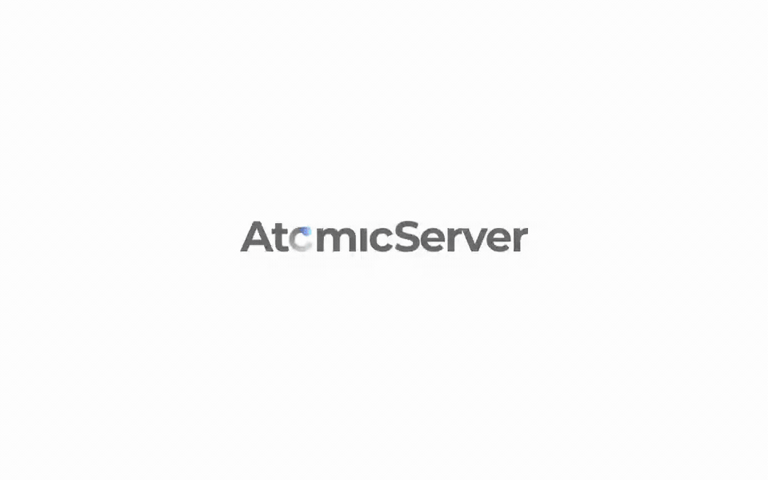

# atomic-ng-bridge

An Atomic Data app, running with no server, whose data lives continuously in a NextGraph document
as ordinary RDF — and comes back the other way.

[Related PR to atomic-server](https://github.com/ontola/atomic-server/pull/1360).

Built for ELFA's WP6 question: can Atomic's mature Tables / Forms / Kanban work *on* NextGraph
without rebuilding them, and without anyone hosting anything?

[](docs/ng-bridge-demo.mp4)

*Forty seconds, unedited: a NextGraph wallet as the only identity, a table typed into the app,
each row arriving in the NextGraph document, and a row renamed from the NextGraph side showing up
in the grid. Click through for the mp4; `e2e/tests/demo.spec.ts` is the script that recorded it,
and every step in it is an assertion.*

## Where this stands

Working, demonstrated, and honest about its edges.

- **The app runs with no AtomicServer.** Real Tables, Forms, Kanban, runtime schema editing,
  version history — the shipping product, over a local-only drive.
- **Its data is in NextGraph, as ordinary RDF.** Atomic property URIs *are* the predicates, every
  subject is a NextGraph IRI under the document (`did:ng:o:<doc>:q:…`, the shape the NG ORM mints),
  every resource carries `isA` **and** `rdf:type` so a native `?s a <Class>` query works, and a
  property from a user-defined ontology round-trips with no configuration. No parallel vocabulary,
  no translation layer, nothing to keep in sync.
- **Both directions.** Local edits reach the document; writes made into the document reach the app.
  Push and pull share one content-hash cursor, which is what stops them feeding each other.
- **One secret.** The Atomic signing key is derived from the user's NextGraph wallet, so there is no
  second identity to manage, and the same wallet gives the same identity on every device. A passkey
  can hold the wallet password, so nothing is typed or stored in the clear.
- **Containment.** A host app adds one dependency and one line. Every piece of NextGraph code lives
  in these packages. Dropping the mirror is reverting one commit.

**What a partner trying it needs**: a broker that accepts their wallet. The public one at
`nextgraph.eu` refuses wallets it has not registered (`NEXTGRAPH-ISSUES.md` B3), so against it the
NextGraph side is in-memory and gone on reload. Against a broker of our own everything persists:
same wallet, same document, same data after a reload, and `e2e/tests/resume.spec.ts` proves it on
every run. `scripts/demo-up.sh` brings that broker up.

**Can you run it from this repository alone? Not yet.** The bridge depends on `@tomic/lib`
0.41.0-beta.2 and on the host app's mirror hooks, both of which live in an atomic-server branch that
is not published yet, so `@tomic/lib` resolves to a local path here (PLAN.md section 10). What is
runnable without that: `pnpm install && pnpm -r test` (the whole bridge and engine, 122 tests, no
wasm, no broker) and `apps/spike` against the SDK. What the full stack looks like is recorded
above, and we will walk anyone through it live on request. The dependency is
resolved by the beta release of `@tomic/lib`, after which this runs from a clone.

## The documents

| | |
| --- | --- |
| **`PLAN.md`** | The architecture, every decision and why, what was verified before it was written, milestones with their real state, and section 12: every UX concession the mirror costs. Start here. |
| **`NEXTGRAPH-ISSUES.md`** | Every limitation, bug and undocumented behavior found in NextGraph, with evidence. 24 numbered findings plus what turned out *not* to be problems, and what we rely on that is documented nowhere. Written to be readable by upstream. |
| **`e2e/README.md`** | The demo as a Playwright test, and what it will honestly fail on. |

## Layout

```
packages/bridge      mapping + both sync directions + the bridge object. Pure, no wasm, no DOM.
packages/ng-engine   the NextGraph engine: transport, wallet/session, wallet-derived identity.
packages/ui          the whole thing as one React component (sign-in, mirror, badge, passkey).
apps/spike           harness for questions about the SDK rather than the product.
e2e                  the demo, recorded.
```

## Running it

```bash
pnpm install
pnpm -r test         # 122 tests, no browser needed
pnpm -r typecheck
```

## Showing the demo

```bash
scripts/demo-up.sh          # broker in a container, app dev server, prints the URL
scripts/demo-up.sh --fresh  # same, with the broker's data wiped first
scripts/demo-down.sh
```

Open the URL it prints. `?ngbridge=1` turns the mirror on and `?ngbroker=` points it at the local
broker; both stick in localStorage, so after the first visit a plain reload is enough. Sign in with
"Continue with NextGraph", make a table, and watch the badge. `NgSyncPanel` shows both sides.

Needs: Docker (OrbStack or Docker Desktop), `../atomic-server` on `feat/ng-bridge`, and the
`ngd` binary built once under `linux/amd64` in `../nextgraph-rs` (`NEXTGRAPH-ISSUES.md` D3 has
the recipe; it does not build on macOS directly).

To prove the stack rather than eyeball it: `NG_BOOTSTRAP_URL=http://localhost:14400/.ng_bootstrap
DEMO_URL=http://localhost:6750 pnpm -C e2e demo` runs both e2e tests against it.

For the app itself, and the M0 harness, see PLAN.md section 11.
